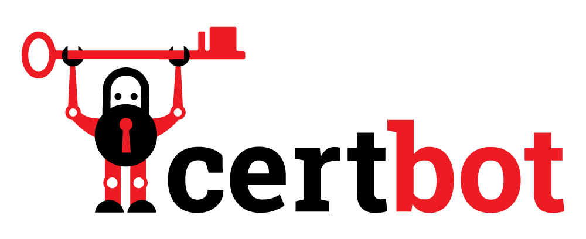
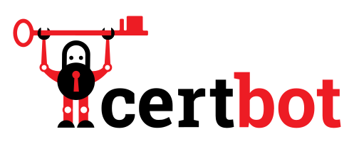
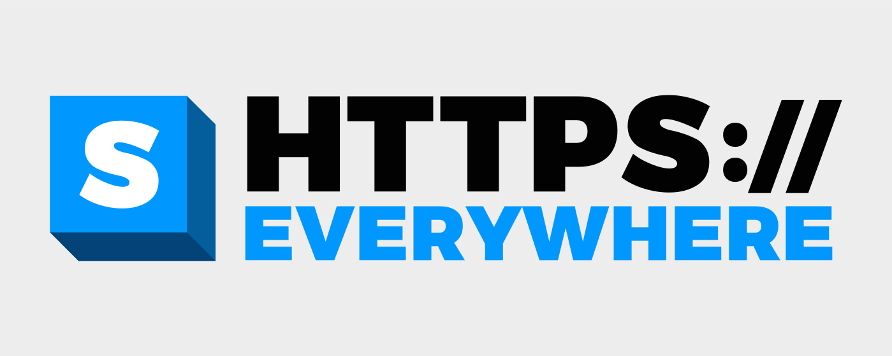
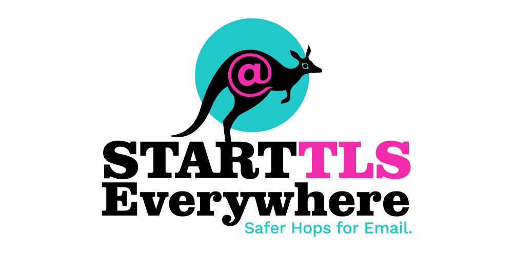
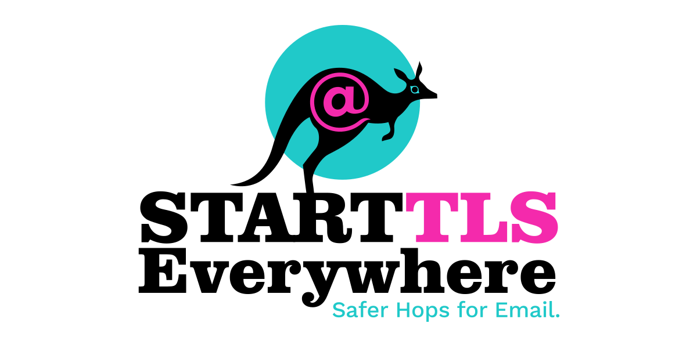
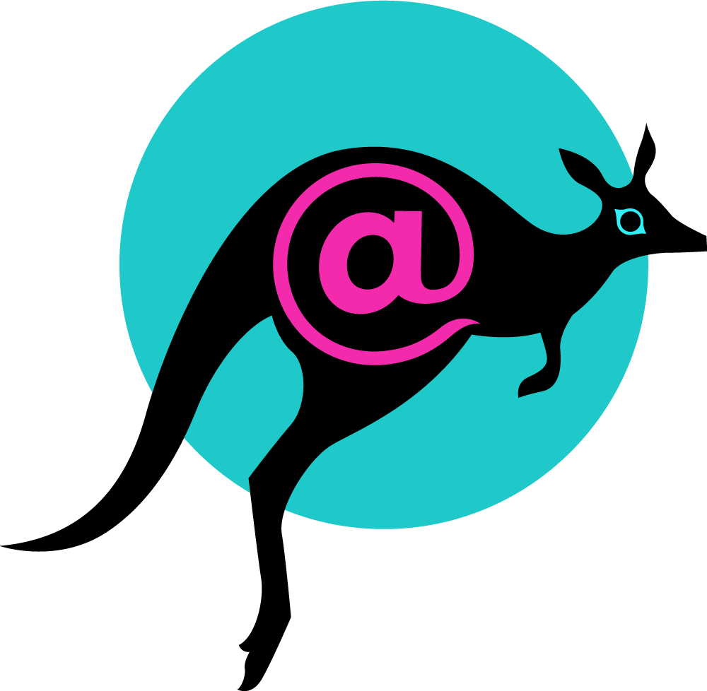
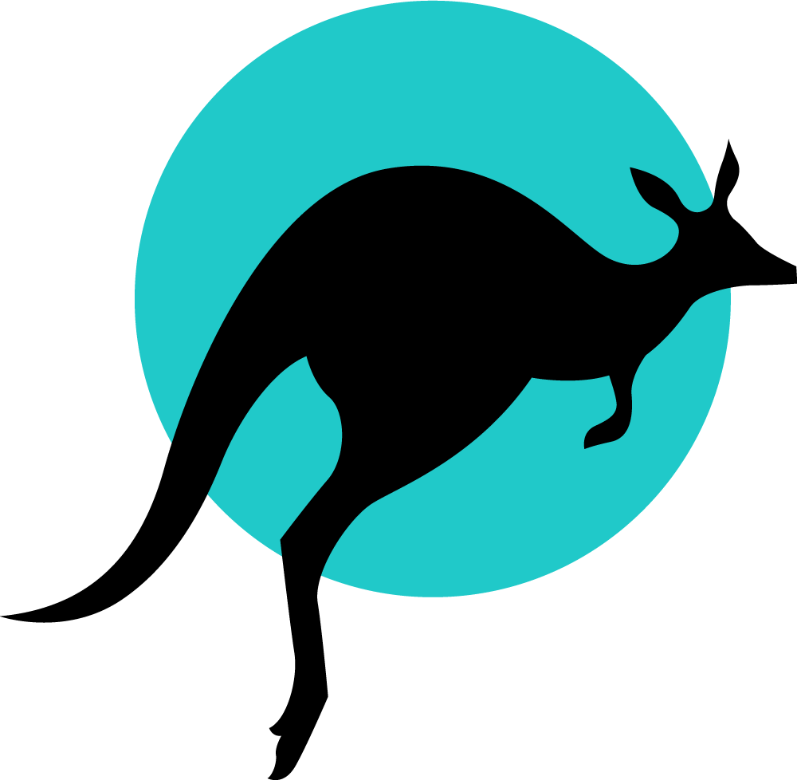
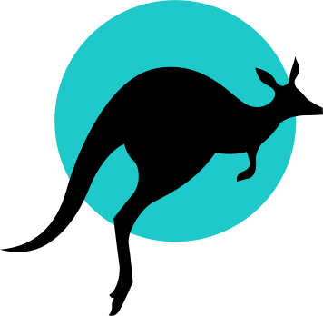

# Logos for EFF Projects
Thanks for your interest in the Electronic Frontier Foundation's work! If you like the free, open source and CC-BY projects from our 501(c)3 nonprofit, please consider [donating to EFF](https://supporters.eff.org/donate) today. We're grateful for your support!

This page includes downloadable assets for our projects. If you have questions on how to use our trademarks—such as using them for slide decks, websites or on stickers—please refer to our [trademark and brand usage policy](https://www.eff.org/pages/trademark-and-brand-usage-policy).

## EFF's logo
The Electronic Frontier Foundation logo, full variations, and logo usage guidelines are included in our [press kit](https://www.eff.org/press/logos).

### EFF lockup
PNG:

SVG:

### EFF monogram
PNG:

SVG:

For more design considerations for our logo, please refer to our [style guide](https://github.com/EFForg/design/blob/master/styleguide.md).

## Certbot
EFF's [Certbot](https://certbot.eff.org) is a free, open source command line tool for automatically using Let’s Encrypt certificates on manually-administrated websites to enable HTTPS.

### Certbot lockup
PNG:

SVG:

### Certbot monogram
PNG:

SVG:

## HTTPS Everywhere
EFF's [HTTPS Everywhere](https://eff.org/https-everywhere), a free, open source browser extension that encrypts your communications with many major websites, making your browsing more secure.

### HTTPS Everywhere lockup
PNG:

SVG:

### HTTPS Everywhere monogram
PNG:

SVG:

## Privacy Badger
EFF's [Privacy Badger](https://eff.org/privacybadger), a free, open source browser extension that stops third party trackers from gathering information about who you are and what you're doing online.

### Privacy Badger lockup
PNG:

SVG:

### Privacy Badger monogram
PNG:

SVG:

## StartTLS Everywhere
EFF's [StartTLS Everywhere](https://starttls-everywhere.org) is a free, open source project to make email delivery more secure.

### StartTLS Everywhere lockup
PNG:

SVG:

### StartTLS Everywhere monogram
PNG:

SVG:

### StartTLS Everywhere icon
PNG:

SVG:

