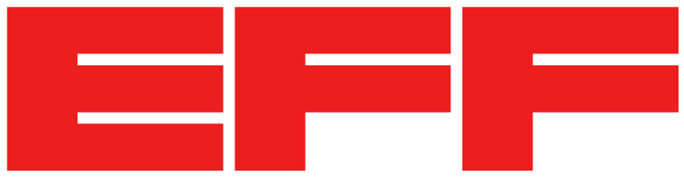

# EFF STYLE GUIDE

## BRAND LOGOS
### History

This is the EFF logo (lockup version). It's big, bold, and (in the extremely biased opinion of this designer who works with it all the time) a joy to use. It also has [a great backstory](https://www.eff.org/deeplinks/2018/07/effs-new-logo-member-shirt) involving a very niche Tumblr blog, disengenuous copyright claims, and a highly regarded design agency. 

### Variations + when to use what
The advantage to having an adaptable, modular logo is that it simply *works* across a variety of use cases. If you've ever tried in vain to squeeze a long logo into a narrow box, or a slim vertical logo into a wide box, you understand how nice it is to have a logo that can, as the kids say, do both. The downside is that a smorgåsbord of variations creates some confusion re: deciding on the best option. Consider this a contextual guide to the many faces of our lovely logo. 

#### EFF Logo (Monogram)

The Monogram is just three bold letters. It should be used in either red or black. Here it is on a white background.

SVG files: 
[Red monogram](logos/EFFbrandguide_BLACKmonogram.svg)
[Black monogram](logos/EFFbrandguide_REDmonogram.svg)

---
#### EFF Logo (Lockup)

SVG Files: 
[Black lockup](logos/EFFbrandguide_BLACKlockup.svg)
[Red lockup](logos/EFFbrandguide_REDlockup.svg)

## COLOR
Our colors are chosen based on a mix of aesthetic preference, branding and accessibility considerations.
As a rule, for non-decorative, functional aspects of our designs (e.g. buttons, links, text), we strive to meet [WCAG guidelines](https://webaim.org/articles/contrast/). We check for color contrast issues, and do our best to remember to use additional indicators aside from primarily color. If we might have overlooked an accessibility issue with any of our color considerations, please get in touch with us.

|                                                                        SWATCH                                                                       |   HEX   |       RGB      |
|:---------------------------------------------------------------------------------------------------------------------------------------------------:|:-------:|:--------------:|
|     | #ec1e1e |  (236, 30, 30) |
|    | #b80101 |   (184, 1, 1)  |
|        | #254B66 | (37, 75, 102)  |
|   | #4B6A88 | (75, 106, 136) |

## TYPOGRAPHY
Note: In some cases, the Google font page is linked to. However, we host the fonts ourselves and do not serve fonts from Google servers. 

For most purposes, we use an open source typyeface called [Montserrat](https://fonts.google.com/specimen/Montserrat). It has several weights, italics, and many special characters. Headings should be rendered in Montserrat bold. Body type should be rendered in Montserrat regular or Montserrat light.

Other typefaces we commonly use are: [League Gothic](https://www.theleagueofmoveabletype.com/league-gothic) (used in our logo), [Meriweather](https://fonts.google.com/specimen/Merriweather) (used for body type on our main website), [Chunk Five](https://www.fontsquirrel.com/fonts/chunkfive) (used for Privacy Badger), and [Lato](https://fonts.google.com/specimen/Lato) (used for one-pagers and other communications).

## PROJECT LOGOS
EFF has a small ecosystem of websites and browser extensions that have standalone branding. [You can find a list of these projects and their corresponding logo files here](https://github.com/EFForg/design/blob/master/logos/logos.md). 

## WEB ELEMENTS
We are slowly but surely working towards standardizing the UI of our one-off websites, action pages, and action pages. FOR MY OWN PURPOSES: what is the best way to link to specific elements from Schatzkin's's style guide? Does she want to make it public? Do code snippets make sense? Should this section link to both her style guide and a folder of .svg files, and 

## LOCALIZATION
As a small design team, we're eventually creating parameters for localized designs of EFF projects, and are keen to receive community feedback to inform our approach. If you're interested in assisting us with localizing our open source software projects, see how you can get involved [here.](https://github.com/EFForg/design/blob/master/L10N.md)

